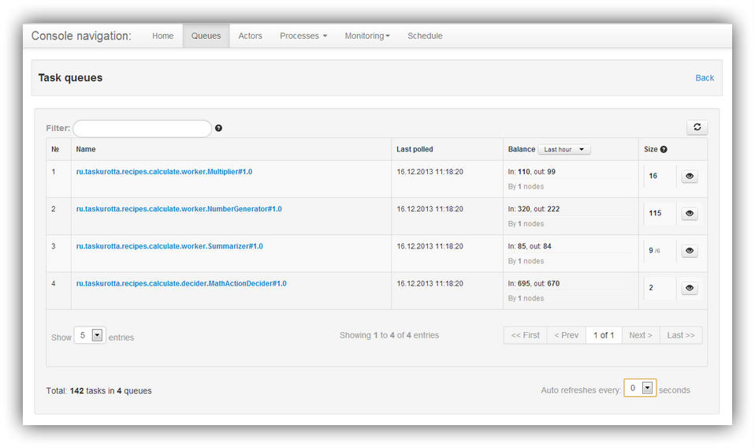
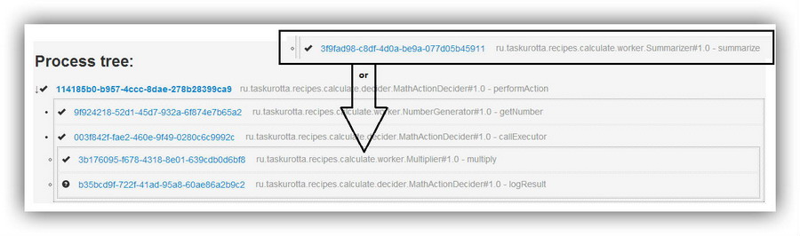
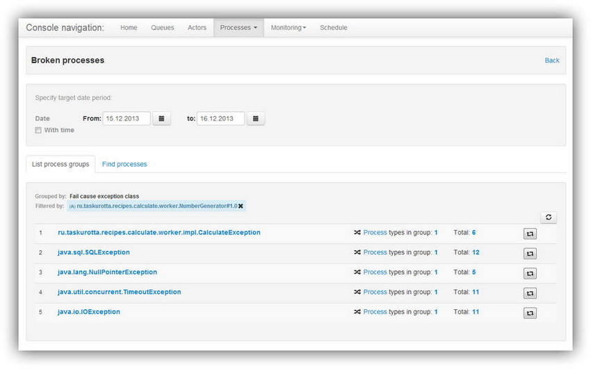

# Overview
## Actors and tasks

TODO: О том что актеры в процессе свой работы пораждают решения. Частью решения могут быть задачи другим актерам и
самому
себе. О зависимостях между задачами. О том что зависимости разруливает Taskurotta выдавая актерам только те задачи,
которые готовы для исполнгения. Пример на пальцах из жизни о стеке задач с зависимостями. J том,
что концентрируем логику управления процесса в координаторах. Деление на координаторов и исполнителей. Координатор
как исполнитель = подпроцесс.

## Distributed architecture

В настоящий момент основной является клиент-серверная архитектура. Сервера образуют кластер с расшаренной памятью и средой исполнения с помощью [Haselcast](http://hazelcast.com/). Клиенты могут обращяться к любому из серверов напрямую или через load balancer. 

## Fine Modularization of Backend

TODO: Все в памяти удержать нельзя - нужно сбрасывать излишки в базу. База должна быть шустрая и хорошо масштабируемая.
Транзакционность это дорого. Выбираем решение при котором старт процесса логируется в оракл. А остальные данные в
MongoDB.

Говорим о том что из за модульности можно собрать различные конфигурации:

- все в памяти. Для быстрого локального тестирования.
- все в hazelcast big memory. Для систем не требующих восстановления состояния после сбоя. Нужно выделить достаточно
памяти. Самая быстрая конфигурация.
- все в hazelcast + mongodb как хранилище. В mongodb вытисняется то что не помещается в память и используется при
необходимости. Для систем требующих восстановления состояния после сбоя. Если есть опыт поддержки mongodb
обеспечивающий необходимый уровень надежности хзранения данных.
- все в hazelcast + mongodb + oracle. В oracle синхронно сохраняется вся информация о процессе при его старте. Если
клиент не получил ошибку то он уверен что процесс запущен. Высокая надежность в ущерб скорости на этапе старта
процесса.

Кроме этого можно собирать без транспорта. Т.е. кластер будет подыматься вместе с актерами в одной JVM.

# Actors API

## Actor Identification

TODO: Имя и версия интерфейса. Отличие версии интерфейса от версии реализации.

## Worker (он же Исполнитель)

### Worker Interface

TDOD: Про зависимости между интерфейсом и реализацией. 

### Worker Implementation

@TODO: class implements interface. example

Координатор не должен зависить от библиотек,
необходимых для работы исполнителей. Только от интерфейсов. Иначе в случае использования maven в качестве менеджера зависимостей, Координатор будет зависеть от всех библиотек, необходимых для работы Исполнителя. Это не верно. Координатору не важна реализация Исполнителя. Ему важен только контракт взаимодействия с ним - т.е. его интерфейс. 

Чтобы избежать не нужного связывания можно поместить интерфес Исполнителя в одну библиотеку а реализацию в другую. Реализация будет зависить от интерфейса, что корректно. А координатор, только от интерфейса.

Существует еще одна проблема связывания. Возможно мы хотим один из существующих сервисов определить как Исполнителя в инфраструктуре Taskurotta. Для этого нам понадобиться определить его контракт (интерфейс) и его версию. Определдение производится с помощью аннотации @Worker у интерфейса. Эта аннотация входит в модуль проекта Taskurotta. Если мы существующий сервис определим как реализацию этого интерфейса, то у него появится зависимоть на проект Taskurotta что не желательно. Для избежания данного связывания можно определить реализацию интерфейса Исполнителя в виде прокси, который принимает задачи по контракту с стороны инфраструктуры Taskurotta и вызывает соответствующие методы существующего сервиса.


## Decider

### Decider Interface

TODO: About @Decider and @Start annotations

### Actors Client Stubs

TODO: Workers and Deciders client interfaces. Why, how create and use. Promises.

### @Asynchronous methods

TODO: decider stub

### @AcceptFail или обработка ошибок исполнителя
Часто в жизни бывает так что исполнители завершают работу выбрасывая исключение. При этом не все исключения одинаково фатальны. Некоторые могут быть вполне безобидны. В таких случаях говорят что исключение - это часть контракта метода, и нужно уметь его обрабатывать в рамках обычного процесса. Для того чтобы в рамках суслика иметь возможность работать с исключениями от исполнителей нужно сделать 2 вещи:  

1 Сообщить суслику о том что все (или некоторые) исключения данного метода данного исполнителя обрабатываются координатором. Для этого в киентском интерфейсе исполнителя отмечаем аннотацией @AcceptFail нужный метод, и в качестве параметра аннотации указываем классы исключений. Пример:

```java
@AcceptFail(type = RuntimeException.class)
Promise<Integer> createNumber();
```

2 В координаторе предусмотреть обработку исключения от исполнителя. Тут у нас есть два разных способа:  

2.1 использовать метод hasFail объекта Promise

```java
if (promise.hasFail()) {
    log.info("got fail: ["+ promise.getFail()+ "]");
} else {
    Integer integer = promise.get();
    log.info("got number: {}", integer);
}
```

2.2 использовать обычный механизм исключений языка java

```java
try {
    worker.killEmAll();                // <- эта задача будет поставлена
    Integer integer = promise.get();   // <- тут выбрасывается Fail
    log.info("got number: {}", integer);
    worker.savePrivateRyan();          // <- эта задача не будет поставлена
} catch (Fail fail) {
    log.info("got exception: "+ fail.getMessage(), fail);
}
```

При обращении к методу promise.get() выбрасывается исключение Fail. Тип изначального исключения можно узнать узнать так: fail.getType(). Нужно помнить что все асинхронные задачи, поставленные до вылета исключения из метода get(), будут поставленны в очереди и выполены (особенность текущей версии). Если выброшенный Fail не будет пойман то процесс будет остановлен как сломанный. Если промайс содержащий Fail будет передан в качестве аргумента исполнителю, то процесс будет остановлен как сломанный. Если указан RetryPolicy, то будет его выполнения и только в случае исчерпания попыток полетит Fail координатору.

TODO:
Далее описываем то что происходит на гранцах одних фич с другими. Например:

- ну и т.д.

### @Wait

### @RetryPolicy
This annotation describe mechanism of retry invoke function, if it catch error. Now exists two implements of it policy: LinearRetryPolicy and ExponentialRetryPolicy.
Obviously, that LinearRetryPolicy make try over equal timeout and ExponentialRetryPolicy try over timeout according by exponent.

### Additional task dependencies

### TaskOptions

## ActorSchedulingOptions

### TaskList
The essence of this option is to put a task in a separate queue which is treated with the same actors
functionality as the common queue. Thus, you can raise the priority of tasks specified taskList.

For example, we have a queue that includes notification of a credit card transaction, and which processes its actor.
But there are transactions that may seem suspicious and should be warned about them as soon as possible.
If put them in the same place, the efficiency we get, but if you put them in a separate queue,
which handles a single actor, this notification will be sent faster due to the smaller size of the queue.

Examples of use can be found in ActorSchedulingOptions package ru.taskurotta.recipes.custom.

### AssertFlow

TODO: Collection<Promise>

### @NoWait

## Taskurotta Bootstrap

Это контейнер для актеров выполняющий следующие задачи:

- Создает транспортный слой для взаимодействия с серверами Taskurotta
- Создает прикладной слой со всеми задекларированными актерами
- Создает и запускает пул рабочих потоков, которые получают задачи от серверов Taskurotta через транспортный слой, передают задачи на выполнение через прикладной слой и возвращают результат на сервера.
- Есть возможность определить Profiler, который будет проксировать вызовы рабочих потоков к транспортному и прикладному слою. С помощью этого, например, можно реализовать мониторинг или влиять на интенсивность взаимодействия с сервером в зависимости от количества задач в очередях для актеров.

- 
Для использования модуля нужно:

TODO: вставить примеры из проекта getstarted. По каждому пункту надо подробно опистать.

- добавить зависимость от него в pom.xml
- добавить плагин для сбора исполняемого jar файла (можно и без этого если указывать список библиотек при старте)
- определить инициализацию актеров руками или с помощью IoC контейнера
- определить в конфигурационном файле следующие блоки:
  - тип транспортного слоя и параметры соединения с серверами.
  - параметры инициализации прикладного слоя
  - параметры пула рабочих оптоков для каждого актера
  - параметры и тип Profiler


# Taskurotta server

## Запуск различных конфигурация

## Использование памяти

## Garbage collector
Goal of garbage collector is deleting process data (e.g. decisions, tasks, graph and process).
Deleting process start after period, which set in garbage collector properties.

Exist several implementation of GarbageCollectorService interface, which use different properties.

- MemoryGarbageCollectorService:
    - gc.pool-size=1 - pool size of tasks, which start garbage collector process for current processId;
    - gc.time-before-delete=1 days - period of storing process, before it will be deleted.

- HzGarbageCollectorService:
    - all parameter of MemoryGarbageCollectorService;
    - gc.queue-name=GarbageCollector - queue name, where store identifier of processes, which ready for delete;
    - gc.enabled=true - the index for enabled or disabled garbage collector.

## Recovery
Recovery - it's a mechanism that monitors the uncompleted process and restores them, if necessary.

 - If process created, but never runs, this process will be started as new
 - If process runs and some tasks are completed, but process uncompleted, recovery find incomplete tasks and send it to workers.

If all infrastructure failed, recovery helps to restart all processes from last state.
Recovery has some properties:

 - recovery.process.change-timeout - if the process worked in during the this timeout, it will not be restored;
 - recovery.find-incomplete-process-period - the frequency with which will be searched unfinished processes;
 - recovery.process.incomplete-timeout - period through which the incomplete process will be sent to recovery;
 - recovery.operation.pool-size - number of threads, which find incomplete process;
 - recovery.operation.queue.name - name of query with incomplete processes id's;
 - recovery.enabled - the index for enabled or disabled garbage collector.

## Web console

Every taskurotta server has an embedded web console to monitor and manage your processes workflow. It can be
opened in a web browser to provide friendly UI for accessing cluster data.

### Features

  - UI is web based: accessible via browser
  - Every node's consoles provide identical information for entire cluster (data are cluster-wide)
  - REST based: data can be extracted directly as JSON objects (simplified integration with 3d party systems)
  - Provides possibility to register and launch tasks on schedule
  - Displays information on current state of the actor's queues
  - Displays information on actors activity
  - Displays current workflows data: tasks, arguments, properties and return values
  - Uses AngularJS as client-side app engine, backed with angular-ui and bootstrap libs

Console UI consists of a set of tabbed views: *"Queues"*, *"Actors"*, *"Processes"*, *"Monitoring"*, *"Schedule"*. Each of
them is described below in details.

### Queues view

  The view provides a paginated list of all actors's task queues registered in a cluster. It is important to know that the information presented
  can be delayed by a few seconds from the actual one. Console uses Taskurotta's metrics service as a source for the information, and it
  requires some time for the data to be updated. Also, all metrics data for the node is lost when the JVM is shutting down or reloads.

  

  Displayed fields are:

  - *"Name"* - task queue name (Note that hazelcast backing collection prefix is omitted). It generally matches the actor ID bind to the queue.
  - *"Last polled"* - last date and time (server side) when an actor polled task from the queue. It could be any actor polled on any node.
  - *"Balance"* - estimate data on task income/outcome of the queue. Income is a summed up number of enqueue invocations for all nodes,
  outcome is a summed up number of task polled from the queue. You can switch between last hour and last 24hours
  - *"Size"* - size of the queue by metrics data. By clicking eye-button ("Show current size") you can get an actual current size by requesting
  the queue itself. Due to performance issues that value cannot be auto updated.

  Note that:

  - It is possible to use *name filter* for filtering queues list. In that case, only queues with names starting with filter value would remain.
  - Pagination and auto refresh properties are stored as a browser cookies. It enables view to keep its state unchanged on browser page
  refresh (and it can be reset by deleting cookies *"queue.list.pagination"* and *"queue.controller.selection"*).

  By clicking queue name link you would be navigated to the list of task UUIDs currently contained at the queue. For large queues this operation
  can take significant amount of time and is not recommended to use.

### Actors view

  Provides list of all actors registered in a cluster. It also enables you to block or unblock actors and compare metrics data for them.

  

  Displayed fields are:

  - *"Actor ID"* - ID of a registered actor
  - *"Queue balance"* - shows queue task income and outcome similar to Queues view. It also estimates rate of task income as:
   <blockquote>
       [number of polled task]/[last - first poll time for period] - [number of new enqueued tasks]/[last - first enqueue time for period]
   </blockquote>
   Red arrow in general means that queue is overflowing with tasks, green arrow means that queue is OK.
  - *"Last activity"* - last date and time (on the server) when an actor of this type polled for task and released task decision. It could be any actor on any node.
  - *"Actions"* - there are two user actions available at the moment: actor *blocking/unblocking* and performance *comparison by metrics* data. When actor is blocked,
  it would get *null* on every poll request, as if it has no task in the queue. By checking two or more actors and clicking "Compare" link actor comparison view is
  showed. There are two main areas on the view: available metrics checkbox list and comparison table. Every metrics checkbox corresponds to the table column. Two
  metrics are checked by default, it is *successfulPoll* and *enqueue* metrics. You are free to check as many metrics as you need.

  Note: actor IDs selected for comparison are stored as browser cookie with name *"actors.compare.actorIds"*. So actors stay selected on browser page reload.

### Processes view

  Processes view is designed to provide data on workflows. It is splitted into separate subviews described below.

##### Processes List subview
  It is a paginated list of all processes (workflows) currently managed by taskurotta. It is a simple table view listing
  *processes UUIDs*, *custom names* (if any defined in their deciders), *start task UUIDs* and *start/end times*. All UUIDs are clickable and refers to
  the corresponding entity detailed views.

  The view for process contains a set of its properties and a *"Process tree"* block. This block conveys the task chain created by process deciders. As it represents a
  very important bit of information lets look into it in more detail. Every process starts with a decider, so on top of the tree there is always an UUID link to the starter
  decider task. Format of the tree line is like this:
  <blockquote>
      &lt;Status icon&gt;-&lt;task UUID&gt;-&lt;Actor ID&gt;-&lt;Method name&gt;
  </blockquote>
  The result of decider execution is a set of tasks for other actors (including itself) so multiple invocations of deciders produce tree-like task
  structure of the process.

  On the example picture below there are two second-level tasks bordered with dotted line and one of them is a decider task again. That task creates
  new set of two tasks. The important part is that decider could have created tasks for different kinds of workers based on obtained return values
  thus changing the workflow behaviour on the fly. In example process decider could have created task for summarizer worker instead of multiplier if
  the returned value of a getNumber worker was even and not odd.

  

  Note: "process tree" does not consider any task dependencies, i.e. the task execution order information is omitted.

  A few words about status icon: there can be three different icons depending on task execution result.

  -  - task have not been released yet and result is unknown
  -  - executed worker have thrown an exception, so workflow execution has an error
  -  - task has been successfully released.

##### Tasks list subview
  It is a paginated list of all tasks similar to the previous one except for addition of some columns with task properties. Arguments are shown
  as a plain JSON strings (cause they actually exist as JSON strings on a server). Click on the UUID link would lead to the emerging of a detailed view
  of a task or a process. Example view for a task is shown on the picture, it contains all the task properties and return values along with the familiar
  tree view starting with the current task this time. If the task is a simple worker, only itself task would appear there.

  

##### Processes Search subview and Tasks Search subview
  These two views make it possible to find tasks/processes by UUID or process custom ID specified by decider implementation. By submitting the search form data
  one can obtain list of processes or tasks satisfying search conditions. Every form input is a "starts with" condition, if more than one input is set, the results
  would be evaluated via AND conditions for all inputs. Example with results is presented below.

  

##### Create Process subview
  This view is designed for development/testing usage only. It enables you to create new processes by passing decider's actor ID, execute method name and valid
  JSONs for task arguments to taskurotta server. Arguments should correspond to the array of JSON-converted ArgContainer objects. Example ArgContainer JSON:

  <blockquote>
      {
        "className": "java.lang.Long",
        "taskId": null,
        "type": "PLAIN",
        "compositeValue": null,
        "promise": false,
        "errorContainer": null,
        "jsonvalue": "1387260495377",
        "ready": true
      }
  </blockquote>

##### Broken processes subview
  If a process's actor exits with an exception the whole workflow just stops. All such stopped processes are presented in the view as broken ones. It is
  up to user to decide for further actions. Whether it is to fix some possible environment or network issues and resume processes by restarting the tasks or just
  delete them. See an example screenshot below:

  

  View is designed with a thought in mind that you are interested not in each broken process itself but the groups of them having common issues. So it enables you to
  operate on processes groups and execute group actions. Or you can of course just inspect group content for individual process actions. Processes can be grouped by several
  attributes: *exception class*, *broken actor ID* and *process starter decider ID*. Also, group content can be filtered by applying same attributes. For instance, it is
  possible to find the group of processes containing only the *java.lang.NullPointerException* exceptions in a processes started by *com.example.ProcessStarterDecider#1.0*
  decider.

  There is also a search form presented that can be used to find processes by some attributes of interest. As always, every form input is an optional *"starts with"*
  condition and all inputs are imposed via *"AND"* operator during the search. The result of the search action is a list of broken processes with the ability to restart or
  delete them.


### Monitoring view


### Schedule view


## Spring integration
  
